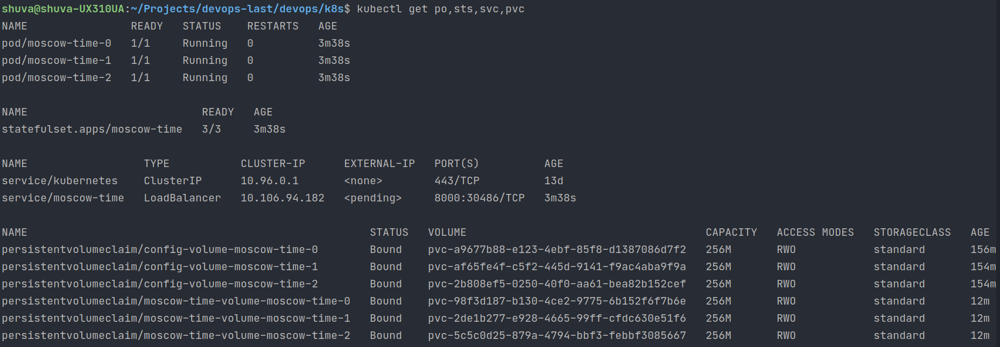
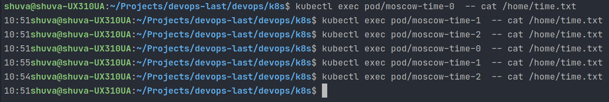

## kubectl get po,sts,svc,pvc


## Check app in several tabs in teh browser


## Explain differences between the output

We used StatefulSets, which guarantee the uniqueness of the pods. They all have independent state, although they use the same specification for creation. That's why th values can be different.

## Why ordering guarantee is unnecessary

We do not need ordering guarantee because our pods do not depend on each other - they can work on their own.

## How to  launch or terminate all Pods in parallel
```
podManagementPolicy: "Parallel"
```
