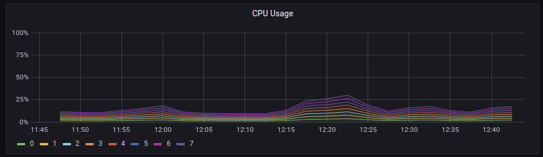
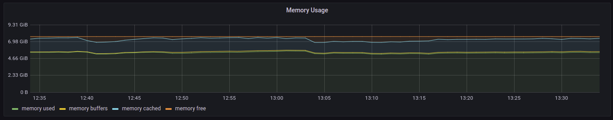
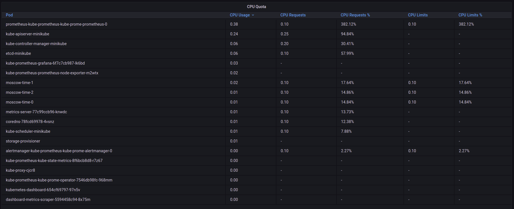
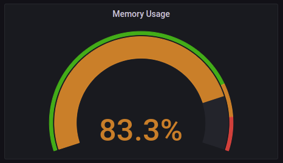
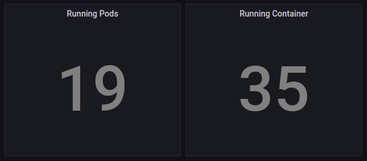
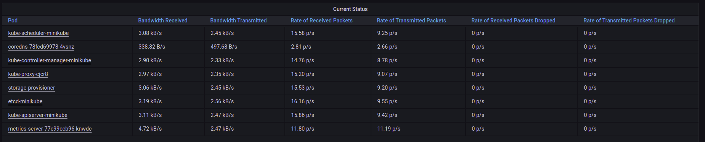
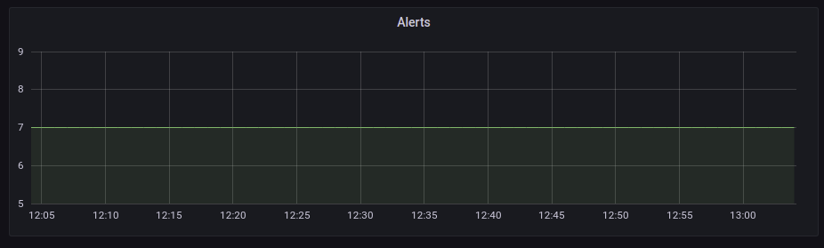

**The Prometheus Operator**

helps to
- deploy
- mange
Prometheus on the k8s cluster

**Prometheus**

collects metrics and statistics

**Alertmanager**

collects alerts and sends them to the right destination

**Prometheus node-exporter**

collects metrics and statistics from the hardware and OS

**Prometheus Adapter for Kubernetes Metrics APIs**

Can be used to replace the already existed server for metrics collection and collect metrics instead.

**kube-state-metrics**

Collects metrics from Kubernetes API server. Checks the heals of deployments, pods and so on.

**Grafana**

To visualize metrics in the beautiful dashboards.

### kubectl get po,sts,svc,pvc,cm
```
shuva@shuva-UX310UA:~/Projects/devops-last/devops/k8s$ kubectl get po,sts,svc,pvc,cm
NAME                                                         READY   STATUS    RESTARTS   AGE
pod/alertmanager-kube-prometheus-kube-prome-alertmanager-0   2/2     Running   0          2m46s
pod/kube-prometheus-grafana-6f7c7cb987-t59c5                 2/2     Running   0          3m29s
pod/kube-prometheus-kube-prome-operator-7546db98fc-55s8g     1/1     Running   0          3m29s
pod/kube-prometheus-kube-state-metrics-8f6bcb8d8-ghb8p       1/1     Running   0          3m29s
pod/kube-prometheus-prometheus-node-exporter-qgqz8           1/1     Running   0          3m29s
pod/moscow-time-0                                            1/1     Running   0          17s
pod/moscow-time-1                                            1/1     Running   0          17s
pod/moscow-time-2                                            1/1     Running   0          17s
pod/prometheus-kube-prometheus-kube-prome-prometheus-0       2/2     Running   0          2m45s

NAME                                                                    READY   AGE
statefulset.apps/alertmanager-kube-prometheus-kube-prome-alertmanager   1/1     2m46s
statefulset.apps/moscow-time                                            3/3     20s
statefulset.apps/prometheus-kube-prometheus-kube-prome-prometheus       1/1     2m45s

NAME                                               TYPE           CLUSTER-IP       EXTERNAL-IP   PORT(S)                      AGE
service/alertmanager-operated                      ClusterIP      None             <none>        9093/TCP,9094/TCP,9094/UDP   2m46s
service/kube-prometheus-grafana                    ClusterIP      10.107.57.167    <none>        80/TCP                       3m29s
service/kube-prometheus-kube-prome-alertmanager    ClusterIP      10.96.47.30      <none>        9093/TCP                     3m29s
service/kube-prometheus-kube-prome-operator        ClusterIP      10.100.94.70     <none>        443/TCP                      3m29s
service/kube-prometheus-kube-prome-prometheus      ClusterIP      10.99.13.223     <none>        9090/TCP                     3m29s
service/kube-prometheus-kube-state-metrics         ClusterIP      10.97.219.192    <none>        8080/TCP                     3m29s
service/kube-prometheus-prometheus-node-exporter   ClusterIP      10.101.106.106   <none>        9100/TCP                     3m29s
service/kubernetes                                 ClusterIP      10.96.0.1        <none>        443/TCP                      13d
service/moscow-time                                LoadBalancer   10.108.223.152   <pending>     8000:31573/TCP               20s
service/prometheus-operated                        ClusterIP      None             <none>        9090/TCP                     2m45s

NAME                                                     STATUS   VOLUME                                     CAPACITY   ACCESS MODES   STORAGECLASS   AGE
persistentvolumeclaim/config-volume-moscow-time-0        Bound    pvc-a9677b88-e123-4ebf-85f8-d1387086d7f2   256M       RWO            standard       4h30m
persistentvolumeclaim/config-volume-moscow-time-1        Bound    pvc-af65fe4f-c5f2-445d-9141-f9ac4aba9f9a   256M       RWO            standard       4h27m
persistentvolumeclaim/config-volume-moscow-time-2        Bound    pvc-2b808ef5-0250-40f0-aa61-bea82b152cef   256M       RWO            standard       4h27m
persistentvolumeclaim/moscow-time-volume-moscow-time-0   Bound    pvc-98f3d187-b130-4ce2-9775-6b152f6f7b6e   256M       RWO            standard       125m
persistentvolumeclaim/moscow-time-volume-moscow-time-1   Bound    pvc-2de1b277-e928-4665-99ff-cfdc630e51f6   256M       RWO            standard       125m
persistentvolumeclaim/moscow-time-volume-moscow-time-2   Bound    pvc-5c5c0d25-879a-4794-bbf3-febbf3085667   256M       RWO            standard       125m

NAME                                                                     DATA   AGE
configmap/18.0.0-grafana                                                 1      4m13s
configmap/18.0.0-grafana-config-dashboards                               1      4m13s
configmap/18.0.0-grafana-test                                            1      4m13s
configmap/18.0.0-kube-prometheus-sta-alertmanager-overview               1      4m13s
configmap/18.0.0-kube-prometheus-sta-apiserver                           1      4m13s
configmap/18.0.0-kube-prometheus-sta-cluster-total                       1      4m13s
configmap/18.0.0-kube-prometheus-sta-controller-manager                  1      4m13s
configmap/18.0.0-kube-prometheus-sta-etcd                                1      4m13s
configmap/18.0.0-kube-prometheus-sta-grafana-datasource                  1      4m13s
configmap/18.0.0-kube-prometheus-sta-k8s-coredns                         1      4m13s
configmap/18.0.0-kube-prometheus-sta-k8s-resources-cluster               1      4m13s
configmap/18.0.0-kube-prometheus-sta-k8s-resources-namespace             1      4m13s
configmap/18.0.0-kube-prometheus-sta-k8s-resources-node                  1      4m13s
configmap/18.0.0-kube-prometheus-sta-k8s-resources-pod                   1      4m13s
configmap/18.0.0-kube-prometheus-sta-k8s-resources-workload              1      4m13s
configmap/18.0.0-kube-prometheus-sta-k8s-resources-workloads-namespace   1      4m13s
configmap/18.0.0-kube-prometheus-sta-kubelet                             1      4m13s
configmap/18.0.0-kube-prometheus-sta-namespace-by-pod                    1      4m13s
configmap/18.0.0-kube-prometheus-sta-namespace-by-workload               1      4m13s
configmap/18.0.0-kube-prometheus-sta-node-cluster-rsrc-use               1      4m13s
configmap/18.0.0-kube-prometheus-sta-node-rsrc-use                       1      4m13s
configmap/18.0.0-kube-prometheus-sta-nodes                               1      4m13s
configmap/18.0.0-kube-prometheus-sta-persistentvolumesusage              1      4m13s
configmap/18.0.0-kube-prometheus-sta-pod-total                           1      4m13s
configmap/18.0.0-kube-prometheus-sta-prometheus                          1      4m13s
configmap/18.0.0-kube-prometheus-sta-proxy                               1      4m13s
configmap/18.0.0-kube-prometheus-sta-scheduler                           1      4m13s
configmap/18.0.0-kube-prometheus-sta-statefulset                         1      4m13s
configmap/18.0.0-kube-prometheus-sta-workload-total                      1      4m13s
configmap/config                                                         1      20s
configmap/kube-prometheus-grafana                                        1      3m30s
configmap/kube-prometheus-grafana-config-dashboards                      1      3m30s
configmap/kube-prometheus-grafana-test                                   1      3m30s
configmap/kube-prometheus-kube-prome-alertmanager-overview               1      3m30s
configmap/kube-prometheus-kube-prome-apiserver                           1      3m30s
configmap/kube-prometheus-kube-prome-cluster-total                       1      3m30s
configmap/kube-prometheus-kube-prome-controller-manager                  1      3m30s
configmap/kube-prometheus-kube-prome-etcd                                1      3m30s
configmap/kube-prometheus-kube-prome-grafana-datasource                  1      3m30s
configmap/kube-prometheus-kube-prome-k8s-coredns                         1      3m30s
configmap/kube-prometheus-kube-prome-k8s-resources-cluster               1      3m30s
configmap/kube-prometheus-kube-prome-k8s-resources-namespace             1      3m30s
configmap/kube-prometheus-kube-prome-k8s-resources-node                  1      3m30s
configmap/kube-prometheus-kube-prome-k8s-resources-pod                   1      3m30s
configmap/kube-prometheus-kube-prome-k8s-resources-workload              1      3m30s
configmap/kube-prometheus-kube-prome-k8s-resources-workloads-namespace   1      3m30s
configmap/kube-prometheus-kube-prome-kubelet                             1      3m30s
configmap/kube-prometheus-kube-prome-namespace-by-pod                    1      3m30s
configmap/kube-prometheus-kube-prome-namespace-by-workload               1      3m30s
configmap/kube-prometheus-kube-prome-node-cluster-rsrc-use               1      3m30s
configmap/kube-prometheus-kube-prome-node-rsrc-use                       1      3m30s
configmap/kube-prometheus-kube-prome-nodes                               1      3m30s
configmap/kube-prometheus-kube-prome-persistentvolumesusage              1      3m30s
configmap/kube-prometheus-kube-prome-pod-total                           1      3m30s
configmap/kube-prometheus-kube-prome-prometheus                          1      3m30s
configmap/kube-prometheus-kube-prome-proxy                               1      3m30s
configmap/kube-prometheus-kube-prome-scheduler                           1      3m30s
configmap/kube-prometheus-kube-prome-statefulset                         1      3m30s
configmap/kube-prometheus-kube-prome-workload-total                      1      3m30s
configmap/kube-root-ca.crt                                               1      13d
configmap/prometheus-kube-prometheus-kube-prome-prometheus-rulefiles-0   28     2m45s
```

```
kubectl get pods // pods
kubectl get sts // StatefulSets
kubectl get svc // services
kubectl get pvc // persistentvolumeclaim
kubectl get cm // configmap
```

1. Check how much CPU and Memory your StatefulSet is consuming.
   
General/Node Exporter/Nodes



2. Check which Pod is using CPU more than others and which is less in the default namespace.

General/Kubernetes/Compute Resources/Node(Pods)

- prometheus-kube-prometheus-kube-prome-prometheus-0 uses CPU more than others
- Pod in the bottom uses less CPU than others

3. Check how much memory is used on your node, in % and mb.

General/Node Exporter/Nodes


4. Check how many pods and containers actually ran by the Kubelet service.

General/Kubernetes/Kubelet


5. Check which Pod is using network more than others and which is less in the default namespace.

General/Kubernetes/Networking/Namespace(Pods)

- coredns-78fcd69978-4vsnz uses network more than others
- kube-controller-manager-minikube uses network less than others

6. Check how many alerts you have.

General/Alertmanager/Overview

There are 7 alerts
