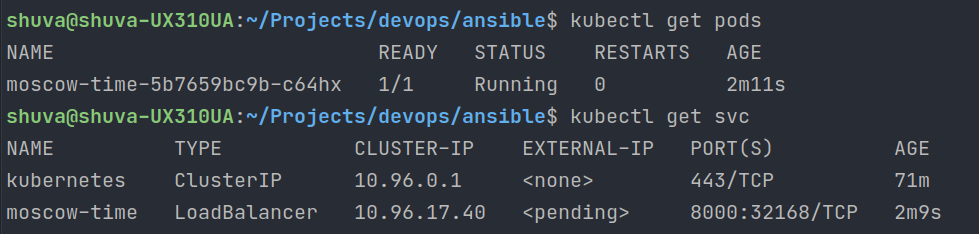
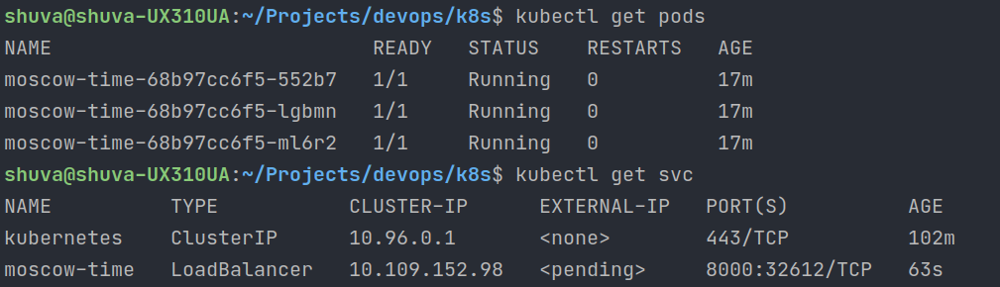

# Screenshots after console commands


# Screenshots after scripts command


# How to use
```bash
devops/k8s> kubectl apply -f deployment.yml
devops/k8s> kubectl apply -f service.yml
devops/k8s> minikube service moscow-time
```
go to http://192.168.49.2:31961/v9.0.1
