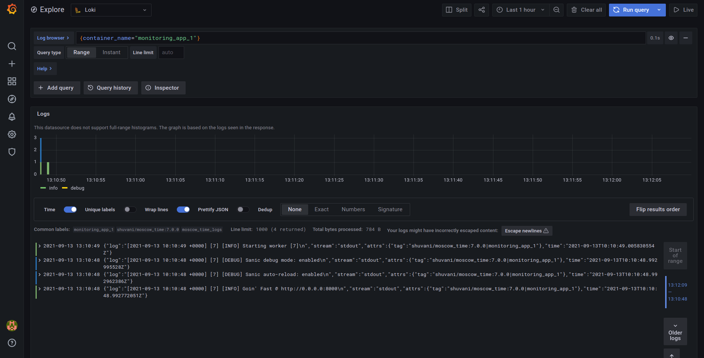

# Loki results

# Best practices

- Static labels: job
- Use dynamic labels sparingly - better to write query "level = warn"
- Label values are bounded
- Use --analyze-labels
- Logs are in increasing time order
- -log-config-reverse-order was used automatically
- Write target because early versions use it
